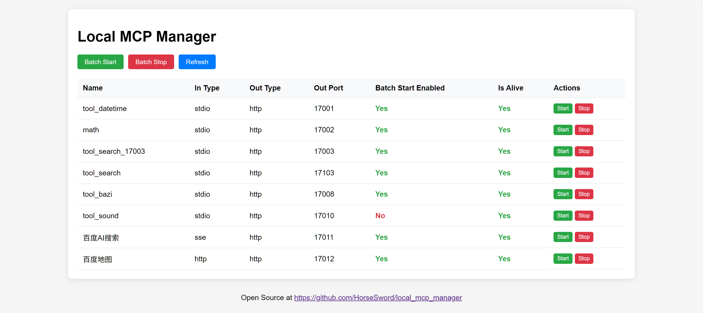
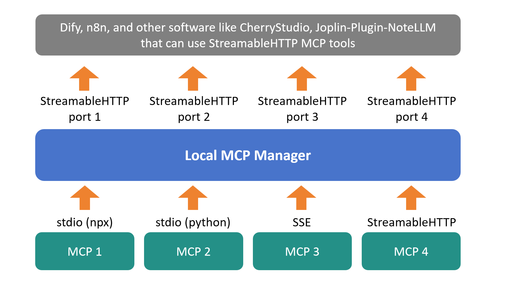

# Local_MCP_Manager

跳转至 [中文说明](docs/README_CN.md)

**Local_MCP_Manager** is an open-source software designed to manage your MCP services in one place. 

Local_MCP_Manager will start all your MCP services (stdio, sse, streamableHTTP) by one click, and every MCP will serve as an individual streamableHTTP MCP server, with given port. 

This is useful for tools "need for streamableHTTP MCP servers", like Dify, n8n, CherryStudio, and my Joplin plugin [NoteLLM](https://github.com/HorseSword/joplin-plugin-notellm).  




## Installation & Usage


### Step 1: Installation

Clone repository to your computer. 

```bash
git clone git@github.com:HorseSword/local_mcp_manager.git
```


Install packages with uv (python):

```bash
uv sync
```


### Step 2: Configure your MCP tools

Copy **mcp_conf.example.json** to **mcp_conf.json**, and add your MCP tools into it.

Param "out_port" must set, and will be used for streamableHTTP MCP port.


Example for npx:

```json
{
    "mcpServers":{
        "stdio-server-npx":{
            "command": "npx",
            "args":["-y","mcp-name"],
            "name": "your node mcp tool",
            "out_port": 17001
        }
    }
}
```

It will serve at "http://127.0.0.1:17001/mcp".


For python:

Reminder: **"cwd"** is very important!

```json
{
    "mcpServers":{
        "stdio-server-python":{
            "command": "uv",
            "args": ["run","python_code.py"],
            "cwd": "path/to/your/code",
            "name": "your python mcp tool",
            "out_port": 17002
        }
    }
}        
```


For SSE MCP server:

```json
{
    "mcpServers":{
        "sse-server-name":{
            "type": "sse",
            "url": "http://localhost:11111/sse",
            "name": "your sse mcp tool",
            "out_port": 17003
        }
    }
}
```


For StreamableHTTP MCP server:

```json
{
    "mcpServers":{
        "http-server-1":{
            "type": "streamableHttp",
            "url": "http://localhost:22222/mcp",
            "headers": {
                "Content-Type": "application/json",
                "Authorization": "Bearer YOUR_TOKEN"
            },
            "name": "your http mcp tool",
            "out_port": 17004
        },
        "http-server-2":{
            "type": "streamableHttp",
            "url": "http://localhost:33333/mcp",
            "name": "your http mcp tool",
            "out_port": 17005
        }
    }
}
```





### Step 3: Run as streamableHTTP MCP servers 

Start the server:

```
uv run local_mcp_manager_flask.py
```

It will run on http://127.0.0.1:17000 by default. 

You can also add `--host` and `--port` to run as you want.


## Tech Stack

Local_MCP_Manager is primarily built with the following technologies:

- **FastMCP**: Handles the core logic of the MCP protocol.
- **Flask**: Used for WebUI.


## Changelog

| Version | Date       | Detail                                   |
| ------- | ---------- | ---------------------------------------- |
| v0.1.1  | 2025-09-11 | Auto load "name" if not given; bug fixed. |
| v0.1.0  | 2025-09-09 | Initial implementation of basic features |

