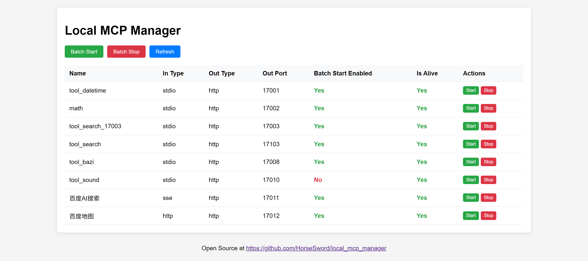
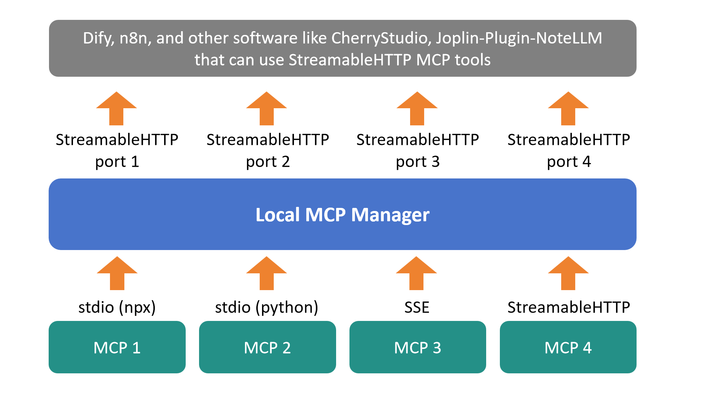

# Local_MCP_Manager

**Local_MCP_Manager** 是一个开源软件，旨在集中管理您的 MCP 服务。

Local_MCP_Manager 只需点击一下即可启动您所有的 MCP 服务（stdio、sse、streamableHTTP），每个 MCP 将作为一个独立的 streamableHTTP MCP 服务器，并运行再您指定的端口上。

这对于需要 streamableHTTP MCP 服务器的工具非常有用，例如 Dify、n8n、CherryStudio 和我的 Joplin 插件 [NoteLLM](https://github.com/HorseSword/joplin-plugin-notellm)。



## 安装与使用

### 第一步：安装

将代码库克隆到您的计算机。

```bash
git clone git@github.com:HorseSword/local_mcp_manager.git
```

使用 uv （python）安装需要的库文件：

```bash
uv sync
```

### 第二步：配置您的 MCP 工具

将 **mcp_conf.example.json** 复制到 **mcp_conf.json** ，并将您的 MCP 工具添加到其中。

参数 "out_port" 必须设置，并将用于 streamableHTTP MCP 端口。

对于 npx 的示例：

```json
{
    "mcpServers":{
        "stdio-server-npx":{
            "command": "npx",
            "args":["-y","mcp-name"],
            "name": "您的节点 MCP 工具",
            "out_port": 17001
        }
    }
}
```

它将在 "http://127.0.0.1:17001/mcp" 提供服务。

对于 python：

提醒：**"cwd"** 是非常重要的！

```json
{
    "mcpServers":{
        "stdio-server-python":{
            "command": "uv",
            "args": ["run","python_code.py"],
            "cwd": "path/to/your/code",
            "name": "您的 python MCP 工具",
            "out_port": 17002
        }
    }
}        
```

对于 SSE MCP 服务器：

```json
{
    "mcpServers":{
        "sse-server-name":{
            "type": "sse",
            "url": "http://localhost:11111/sse",
            "name": "您的 SSE MCP 工具",
            "out_port": 17003
        }
    }
}
```

对于 StreamableHTTP MCP 服务器：

```json
{
    "mcpServers":{
        "http-server-1":{
            "type": "streamableHttp",
            "url": "http://localhost:22222/mcp",
            "headers": {
                "Content-Type": "application/json",
                "Authorization": "Bearer YOUR_TOKEN"
            },
            "name": "您的 HTTP MCP 工具",
            "out_port": 17004
        },
        "http-server-2":{
            "type": "streamableHttp",
            "url": "http://localhost:33333/mcp",
            "name": "您的 HTTP MCP 工具",
            "out_port": 17005
        }
    }
}
```



### 第三步：作为 streamableHTTP MCP 服务器运行

启动服务器：

```
uv run local_mcp_manager_flask.py
```

它将默认运行在 http://127.0.0.1:17000。

您还可以添加 `--host` 和 `--port` 来按照您的需要运行。

## 技术栈

Local_MCP_Manager 主要使用以下技术构建：

- **FastMCP**：处理 MCP 协议的核心逻辑。
- **Flask**：用于 WebUI。

## 更新日志

| 版本   | 日期       | 详细信息           |
| ------ | ---------- | ------------------ |
| v0.1.0 | 2025-09-09 | 基本功能的初始实现 |